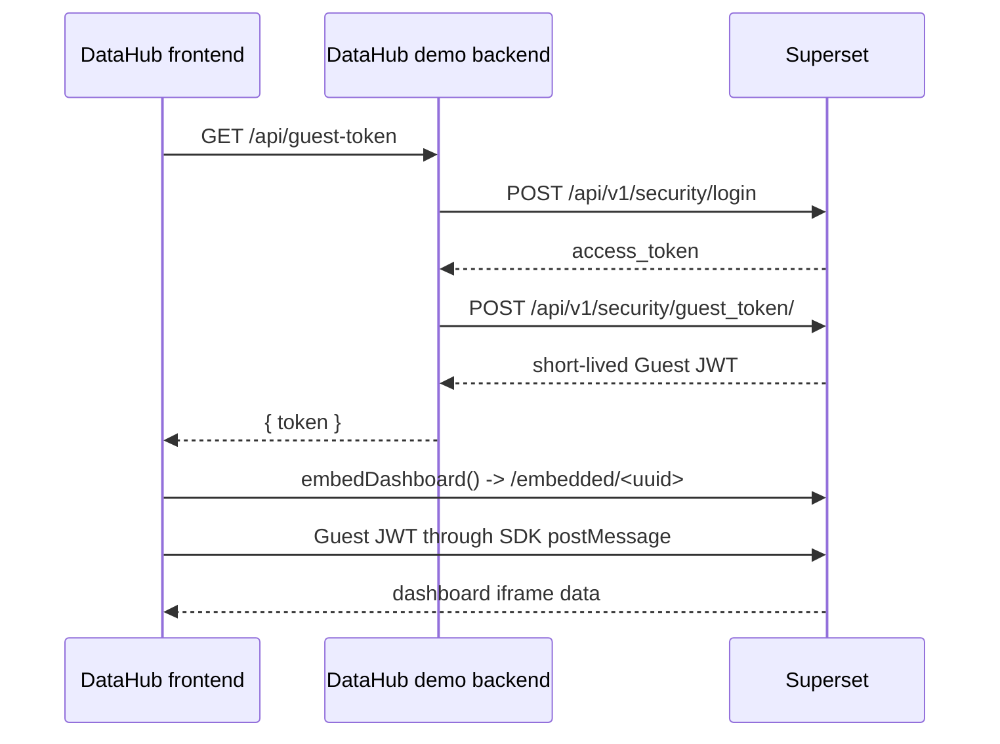

<!--
  Licensed to the Apache Software Foundation (ASF) under one
  or more contributor license agreements.  See the NOTICE file
  distributed with this work for additional information
  regarding copyright ownership.  The ASF licenses this file
  to you under the Apache License, Version 2.0 (the
  "License"); you may not use this file except in compliance
  with the License.  You may obtain a copy of the License at

    http://www.apache.org/licenses/LICENSE-2.0

  Unless required by applicable law or agreed to in writing,
  software distributed under the License is distributed on an
  "AS IS" BASIS, WITHOUT WARRANTIES OR CONDITIONS OF ANY
  KIND, either express or implied.  See the License for the
  specific language governing permissions and limitations
  under the License.
-->

# DataHub Embedded Superset demo

This example demonstrates the requirement #2 flow: an external DataHub web app
embeds one Superset dashboard using `@superset-ui/embedded-sdk` and a short-lived
Guest Token. The browser never receives the Superset service-user credentials or
the Superset access token.



## What Superset already provides

This demo uses the existing Superset mechanisms:

- `FEATURE_FLAGS["EMBEDDED_SUPERSET"]` enables embedded dashboards.
- `POST /api/v1/security/login` returns a server-side `access_token` for a
  Superset service user.
- `POST /api/v1/security/guest_token/` requires the `grant_guest_token`
  permission and accepts `resources` plus required `rls`.
- `/embedded/<uuid>` is the built-in embedded route. Its UUID is the
  `EmbeddedDashboard.uuid`, not the numeric dashboard ID.
- `embedDashboard()` creates the iframe, sends the Guest Token through the
  SDK message channel, and refreshes the Guest Token automatically.

## Superset configuration

Copy or merge [superset_config_embedded_demo.example.py](superset_config_embedded_demo.example.py)
into the Docker development configuration. It enables `EMBEDDED_SUPERSET` and
adds `http://localhost:5173` to `frame-ancestors` in both production and dev
Talisman configurations. Restart Superset after changing it.

The demo backend calls Superset server-to-server, so Superset CORS is not needed
for the token exchange. The backend itself enables CORS only for
`FRONTEND_ORIGIN`, because the browser calls the backend directly.

The embedded iframe also needs the dashboard's existing allowed-domain check to
accept `http://localhost:5173`. This is configured through Superset's built-in
**Embed dashboard** dialog; this example does not add a separate Allowed Domains
feature.

## Dashboard setup

1. Sign in to Superset as an administrator.
2. Open the dashboard to embed.
3. Open the dashboard actions menu and choose **Embed dashboard**.
4. Enter `http://localhost:5173` as the allowed domain and save.
5. Copy the generated **Embedded dashboard UUID** into both `.env` files.

The Guest Token resource must contain this embedded UUID. A numeric dashboard
ID is not interchangeable with the UUID used by `/embedded/<uuid>`.

The service user used by the backend must have the `can_grant_guest_token`
permission. Grant it only to a dedicated local demo service user with the
minimum dashboard access needed for this demonstration.

## Environment

Create the backend environment file:

```powershell
cd examples/embedded-datahub/backend
Copy-Item .env.example .env
```

Set these values in `backend/.env` through the shell or a local environment
loader. Never commit the file:

| Variable | Purpose |
| --- | --- |
| `SUPERSET_URL` | Superset origin, for example `http://127.0.0.1:8088` |
| `SUPERSET_USERNAME` | Dedicated Superset service-user username |
| `SUPERSET_PASSWORD` | Dedicated service-user password |
| `SUPERSET_DASHBOARD_UUID` | EmbeddedDashboard UUID |
| `FRONTEND_ORIGIN` | Browser origin, normally `http://localhost:5173` |

Create the frontend environment file:

```powershell
cd examples/embedded-datahub/frontend
Copy-Item .env.example .env
```

Set `VITE_SUPERSET_URL`, `VITE_SUPERSET_DASHBOARD_UUID`, and
`VITE_DEMO_BACKEND_URL`. Only public origins and the embedded UUID belong in
the frontend environment. Do not put credentials or signing secrets there.

## Run the demo

Build the local SDK package once:

```powershell
cd superset-embedded-sdk
npm install
npm run build
```

Run the backend in one terminal. PowerShell does not automatically load `.env`,
so set the variables in the session before starting Flask:

```powershell
cd examples/embedded-datahub/backend
python -m venv .venv
.\.venv\Scripts\Activate.ps1
pip install -r requirements.txt
$env:SUPERSET_URL = "http://127.0.0.1:8088"
$env:SUPERSET_USERNAME = "your-local-service-user"
$env:SUPERSET_PASSWORD = "your-local-password"
$env:SUPERSET_DASHBOARD_UUID = "your-embedded-dashboard-uuid"
$env:FRONTEND_ORIGIN = "http://localhost:5173"
python app.py
```

Run the frontend in a second terminal:

```powershell
cd examples/embedded-datahub/frontend
npm install
npm run dev
```

Open <http://localhost:5173>. The frontend calls only
`http://127.0.0.1:5001/api/guest-token`; it never calls Superset login or Guest
Token APIs directly.

## Authentication and CSRF behavior

The backend authenticates with the Superset JWT login endpoint, extracts the
server-side access token, and uses it as a Bearer token for the Guest Token API.
The current Guest Token API path is protected by Flask-AppBuilder
authentication and the `grant_guest_token` permission. This flow does not use a
browser session or expose a CSRF token, so the demo does not add CSRF cookies or
disable CSRF globally.

If login returns `401`, check the service-user credentials and provider `db`.
If Guest Token creation returns `401` or `403`, check the access token and
`can_grant_guest_token` permission. If it returns `400`, check that the UUID is
the EmbeddedDashboard UUID and that the payload includes `rls: []`.

## CORS and iframe troubleshooting

- A browser CORS error on `/api/guest-token` means `FRONTEND_ORIGIN` does not
  exactly match the frontend origin, including scheme and port.
- An iframe refused by `frame-ancestors` means the example config was not loaded
  or Superset was not restarted. The allowed value is scoped to
  `http://localhost:5173`.
- An embedded access error usually means the dashboard's existing allowed-domain
  setting does not contain `http://localhost:5173`, or the UUID is wrong.
- A Superset login screen indicates the Guest Token was not delivered to the
  iframe. Check the browser console and the backend response without printing
  the token.

## Security notes

- Credentials and Superset access tokens remain server-side.
- The browser receives only the short-lived Guest Token returned by the demo
  backend; it is not logged by the frontend or backend.
- The token contains one dashboard resource and an empty RLS list. Tenant RLS
  and multi-tenant isolation are intentionally out of scope.
- The demo uses a dedicated local service user and a local origin. Use HTTPS,
  a strong secret, and a deployment-specific origin in real environments.
